# ATGL - LABOR | Awan & Pircher

## Use Case - Sandra                                                                                                  
#
### Aufgabenstellung
Aufgabe ist es, unter Berücksichtigung des gewählten Raumes, technische Lösungen nach Sandras Wünschen zu entwickeln und anzuwenden. Der Raum für den diese Gruppe sich entschieden hat, ist das Wohnzimmer.

### Kurzbeschreibung Klientin: Sandra
Die modernen Hilfsmittel, die wir zur Verfügung haben, sind ideal dafür der Klientin Sandra, ihren Wunsch nach einem selbstständigeren Leben zu erfüllen. Weil sie nicht nur körperlich beeinträchtigt ist, sondern auch eine starke Sehschwäche hat, müssen die Hilfsmittel klug gewählt werden.

Die Klientin verfügt bereits über einen Rollstuhl, einen Laptop und ein Smartphone. Die letzteren Zwei müssen aufgrund der Tatsache, dass sie Buchstaben nur in dreifacher Größe wahrnehmen kann (b21000) und über eine Rotschwäche (b21021) verfügt, dementsprechend angepasst werden. Außerdem ist die Einstellung eines höheren Kontrastes von Nöten (b21022). 

Dass sie dennoch über gewisse körperliche Funktionen verfügt, ermöglicht einen größeren Spielraum bei der Verwendung von Hilfsmittel. Abgesehen davon, dass sie ihren Kopf bewegen kann, sind auch Daumen und Zeigefinger am linken Arm vollkommen funktionstüchtig. Die Tatsache, dass sie ihren Mund bzw. ihre Lippen bewegen kann, ermöglicht die Verwendung einer FlipMouse. 

Die Tatsache, dass Zeigefinger und Daumen (am linken Arm) funktionstüchtig sind, lässt mehr Optionen offen. Da eine Kopf- und Mundbewegung möglich ist, tritt die Möglichkeit FlipMouse verwenden zu können in den Vorschein.

Die Klientin Sandra hofft, Licht, Temperatur, Jalousien und viele elektronische Geräte wie Fernseher, Musikanlagen und Spielzeug selbstständig steuern zu können. Außerdem möchte sie den Computer so steuern können, dass sie online gehen, E-Mails schreiben und beantworten kann. Außerdem möchte sie mit Hilfe von Phillips Hue Go oder Infrarotlicht Sounds kreieren, Computerspiele adaptieren und visuelle Effekte erzeugen. Ihr letzter Wunsch ist, dass sie ohne Hilfe ihr Smartphone zum SMS Versenden oder Anrufe tätigen verwenden kann.
#
## AsTeRICs Grid

AsTeRICS Grid ist so konzipiert, dass jeder es verwenden kann. Es kann durch normales Klicken oder Berühren der Maus oder durch Bewegen oder Scannen von Personen mit eingeschränkten motorischen Fähigkeiten eingegeben werden. Die Eingabemethode kann an die Bedürfnisse des Benutzers angepasst werden. Das Scannen kann durch Tasten auf der Tastatur, Zusatztasten (wie FABI) oder unkonventionelle Optionen (wie Signale von EMG-Muskelsensoren) ausgelöst werden.

Als Hauptmenü gibt es eine Auswahl der verschiedenen Räume

### Wohnzimmer Hauptgrid

Hier können Licht allgemein ein/aus gechaltet werden, sowie über eine weitere Schaltfläche in ein untermenü navigiert werden, um die Leds zu dimmen.
Um die Temperatur einzustellen, kann auch in ein untermenü navigiert werden.
Für die Mediensteuerung gibt es ebenfalls ein weiteres Untermenü.
Die Jalousien werden nach Druck auf "Jalousie HOCH" / "Jalousie RUNTER" vollständig herunter/hinauf bewegt, es sei denn es wird "Jalousien STOPP" gedrückt.

### Temperatur einstellen Wohnzimmer

Die Temperatur kann auf 20°C, 22°C, 24°C eingestellt werden.
Heizung EIN oder AUS kann ausgewählt werden, sowie Absenken.

### Lichtsteuerung Wohnzimmer

DIe Lichtsteuerung ist für Wohn-, Schlaf- und Küchenbereich in einem Grid zusammengefasst.
Es können hier die jeweiligen Lampen ein/aus geschaltet werden, sowie für Wohn und Schlafzimmer die Lichter auf 35% oder 65% gedimmt werden.
### Mediensteuerung Wohnzimmer

Auswahlmenü, welches Gerät gesteuert werden soll.
Tv führt zu einem untergrid zur Fernsehsteuerung, Radio zu einem untergrid Radiosteuerung.
Spielzeug Ein/Aus schaltet ein Spielzeug direkt ein/aus

### Radiosteuerung Wohnzimmer

Es klnnen verschiedene voreingestellte Radiosender ausgewählt werden ( Ö1, Ö3, Hard Rock, FM4, ORF).
Das Radio ein/aus geschalten werden, die lautstärke erhöht/verringert werden.
Es kann auch manuell zwischen Radiosendern gewechselt werden.

### Fernsehsteuerung Wohnzimmer

Fernsehsteuerung mit Nummernpad zur eingabe eines Senderkanals. 
Der Fernseher kann ein/aus geschalten werden, die Lautstärke erhöht/verringert werden.
Es kann auch manuell zwischen Fernsehsendern gewechselt werden.
Quelle auswählen dient zur auswahl anderer Geräte, die am TV angeschlossen sind.

## Eingabegeräte - FlipMouse & FABI
### FlipMouse

FLipMouse ist ein Kit alternativer Eingabegeräte für Computer und andere elektronische Geräte. Der richtungsunabhängige Joystick der FlipMouse ist sehr sensibel und kann subtile Bewegungen wie Mund- oder Fingerbewegungen auswerten. Klickaktivitäten können durch Veränderung des Drucks auf das Mundstück (Nippen/Saugen) oder durch Anschließen eines externen Tasters erreicht werden. Dies ermöglicht eine präzise Steuerung von Maus und Tastatur sowie eine kabellose Steuerung des Geräts über Infrarotsignale oder Bluetooth.

#### FlipMouse Einstellungen

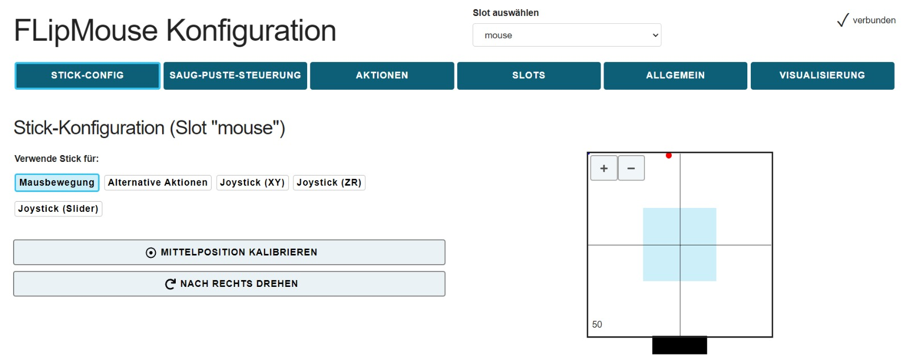

Die FlipMouse wurde auf der Fabiwebseite (flipmouse.asterics.eu) nach unseren Bedürfnissen konfiguriert.

#### FlipMouse Messwerte

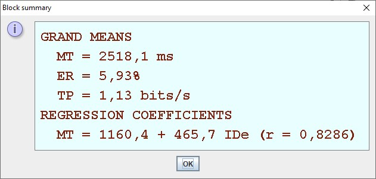

### FABI

FABI (Flexible Assistive Button Interface) ist ein Eingabegerät für einen Computer oder ein Smartphone mit max. 9 Anschlüssen. An diesen Anschlüssen können bis zu 9 Tastern oder selbstgemachte elektrische Kontakte angeschlossen werden. Mithilfe von FABI ist es möglich den Mauszeiger zu steuern, sowie das Drücken mithilfe von Taster. Die Funktionen werden durch eine grafische Software angepasst.

#### FABI Einstellungen

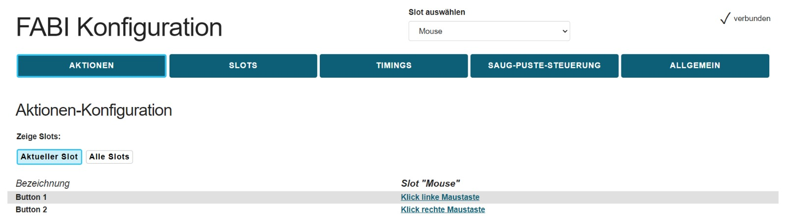

Um das Fabi zu konfigurieren wurde die Fabiwebseite (fabi.asterics.eu) aufgerufen. Dabei wurde ein Slot zum Hill Climb Racing spielen erstellt und ein weiterer Slot zum benutzen der Grid Oberfläche. 

#### FlipMouse + FABI Anwendung

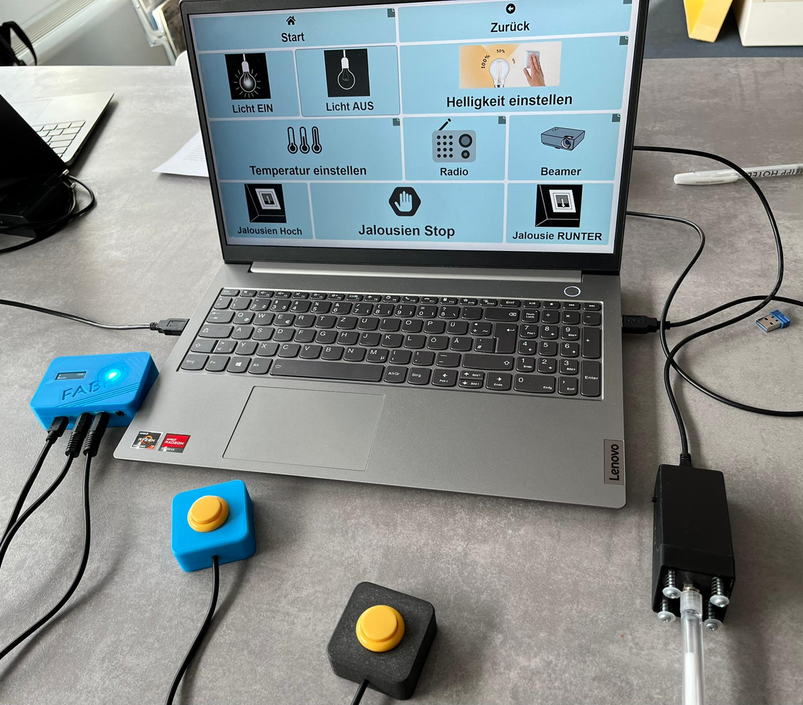

Der FABI sowie die FlipMouse werden an den Laptop angeschlossen. Hierbei wird ein USB Kabel verwendet. 

## Betriebssystem (Windows) - Accesibility

Microsoft ist bestrebt, seine Produkte und Dienste für alle so zugänglich und nutzbar wie möglich zu machen. Windows 10 enthält Barrierefreiheitsfunktionen, von denen alle Benutzer profitieren können. Diese Funktionen erleichtern die Anpassung des Computers und bieten Benutzern unterschiedlicher Erfahrungsstufen Optionen zur Verbesserung der Windows-Erfahrung.

### Bildschirmlupe

Die Bildschrimlupe ist eine Funktion von Windows die dabei helfen soll, den akutellen Bildschriminhalt zu vergrößern. Da Sandra nur Buchstaben in dreifacher Größe erkennen, löst diese Funktion ihre Probleme wenn sie mit dem Computer arbeitet.
#### Aktivierung + Einstellung - Bildschirmlupe
Um die Bildschirmlupe zu aktivieren kann die Windows-Logo-Taste + Plus-Taste (+) verwendet werden. Das Deaktivieren der Bildschirmlupe erfolgt über Windows-Logo-Taste + ESC.
Da es für Sandra leichter ist die Maus zu bedienen, kann einfach das Start-Symbol wählen -> Einstellungen -> Erleichterte Bedienung -> Bildschirmlupe -> Bildschirmlupe aktivieren.

In den Einstellungen kann der Zoomfaktor verändert werden, sowie die Zoomintervalle. Außerdem wird durch die Bedingung "Bildschirmlupe nach der Anmeldung starten" und "Bildschrimlupe vor der Anmeldung für alle Benutzer starten" die tägliche Anwendung der Bildschirmlupe erleichtert.
Bei der Bildschirlupenansicht können 3 Funktionen eingestellt werden.

  1. Vollbild - Der gesamte Bildschriminhalt wird vergrößert dargestellt. Auf dem Monitor sieht man immer einen Ausschnitt.
 
  
  
  2. Angedockt - Die Vergrößerung erscheint in einem gesonderten Fensterbereich, den Sie beliebig verschieben können.
  
 
 
  3. Lupe - Der bereich unter dem Mauszeiger erscheint vergrößert. Die Größe der Lupe kann ebenfalls eingestellt werden

 
 
Außerdem kann man einstellen, wem die Bildschirmlupe folgen soll.

#### Anwendung - Bilschirmlupe

Mit der Funktion "-" und "+" kann die Verkleinerung bzw. Vergrößerung der Bildschrimlupe gesteuert werden. Die Anzeige zwischen denen zeigt den aktuellen Zoom an. Wobei 100% das Minimum ist und 1600% das Maximum.

Um die Lesefunktion zu aktivieren, muss der Text den man vorgelesen haben möchte, markiert werden. Danach drückt man einfach auf "Play". Mit der Funktion "Ab hier lesen" (der Mauszeiger mit dem kleinen Lautsprecher) kann man eine Zeile auswählen, die schließlich vorgelesen wird.

Die Einstellungen der Bildschirmlupe ermöglichen es die Geschwindigkeit des Sprechers zu modifizieren, genau so wie die Sprache und die Stimme des Sprechers.

### Spracherkennung
Mit der Spracherkennung von Windows 11 kann man in innerhalb kürzester Zeit Texte diktieren. Die Funktion wird automatisch aktiviert und kann direkt benutzt werden.
#### Aktivierung - Spracherkennung
Um die Spracherkennung zu aktivieren geht man auf Start -> Einstellungen -> Erleichterte Bedienung -> Spracherkennung -> Spracherkennung aktivieren

#### Anwendung - Spracherkennung
Mithilfe eines Spracheingabegeräts können Befehle mit der Spracherkennung ausgeführt werden. Hierzu drückt man den Knopf mit dem Symbol eines Mikrofons und gibt einen Befehl per Headset oder Mikrofon ein.
Falls die Bedienung den Befehl verstanden hat führt sie ihn aus. Wenn sie den Befehl nicht verstanden hat, zeigt die Anzeige den Text "Wie bitte?". Danach bekommt man die Möglichkeit nochmal einen Befehl einzugeben.

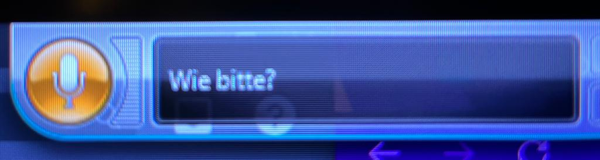

## iPhone - Accesibility

### Einstellungen

Apple bittet sehr viele Möglichkeit um die Bedienung von iPhones zu erleichtern. Da Sandra Sehschwächen hat, können auf dem iPhone Einstellungen vorgenommen werden.

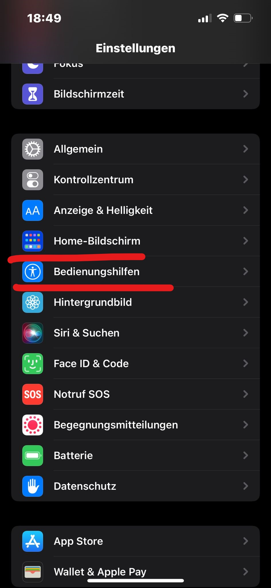

Einstellungen -> Erleichterte Bedienung. Hier findet man die Einstellungen für alle Erleichterungen.

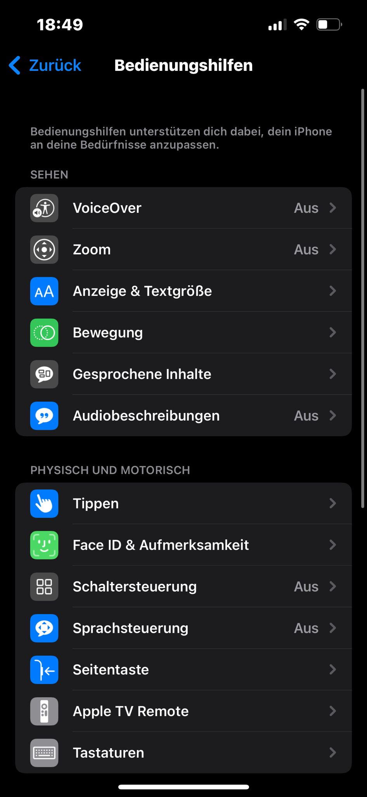

Unter der Kategorie "Sehen", werden alle Einstellungen für Meschen mit Sehschwächen angezeigt.
Das "VoiceOver" spricht die Bildschrimobjekte aus, ähnlich wie bei "Gesprochene Inhalte". 
Das "Zoom" vergrößert den gesamten Bildschrim.
Bei der Einstellung "Anzeige & Textgröße" kann der Text auf dem gesamten Smartphone fetter dargestallt werden. Außerdem kann man die Textgröße einstellen.
Bei der "Audiobeschreibung" werdn vorhandene Audiobeschreibungen automatisch abgespielt.

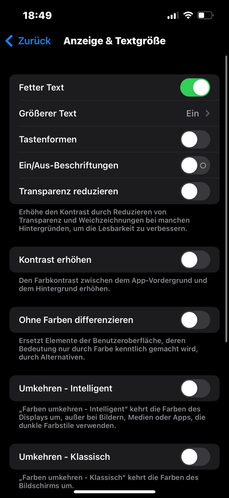

Unter der Einstellung "Anzeige & Textgröße" können nun mehrere Einstellungen vorgenommen werden. Da Sandra an Protanopie leidet und nur Buchstaben in dreifacher größe sehen kann, muss der Kontrast erhöht werden. Hier wird der Farbkontrast zwischen dem App-Vordergrund und dem Hintergrund erhöht.

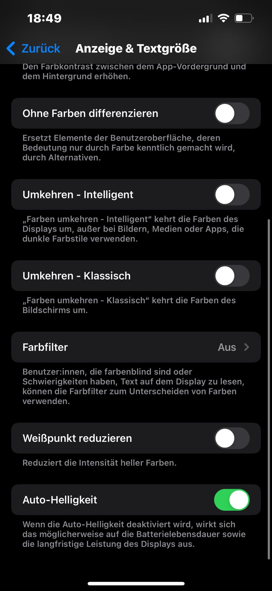

Der Farbfilter ist für BenutzerInnen die farbenblind sind. Diese Einstellung ist sehr wichtig für Sandra, daher muss sie aktiviert werden.

### Farbfilter

Es gibt mehrere Optionen für den Farbfilter. Sandra leidet unter Protanopie, dass heißt das dieser Filter aktiviert wird. Jedoch kann mit dem Regler die Intensität eingestellt werden.

### Nachricht schreiben - iPhone

https://user-images.githubusercontent.com/95292673/145266870-2d591137-86a1-462d-bbca-3a6fc3928e08.mp4

## Aufbau

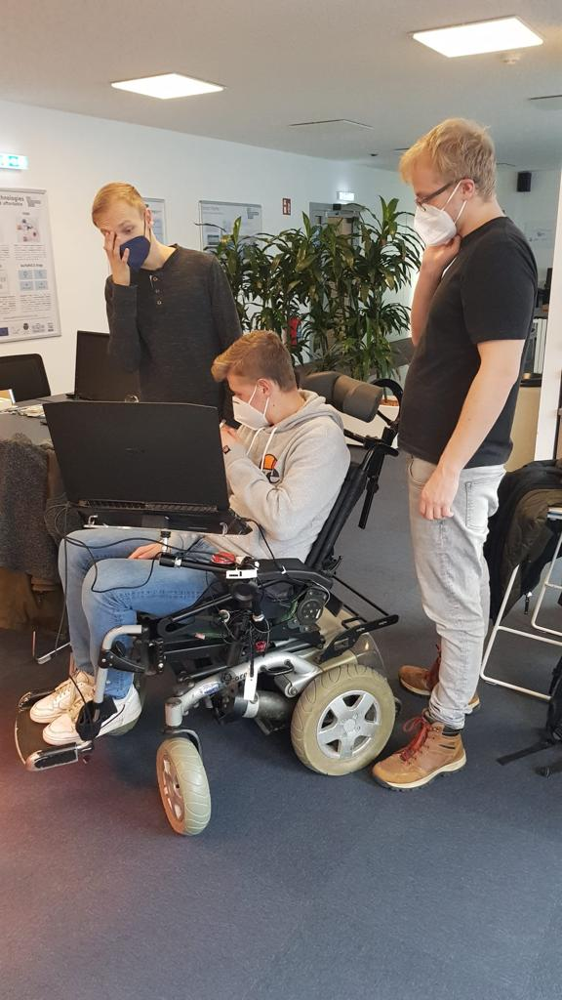

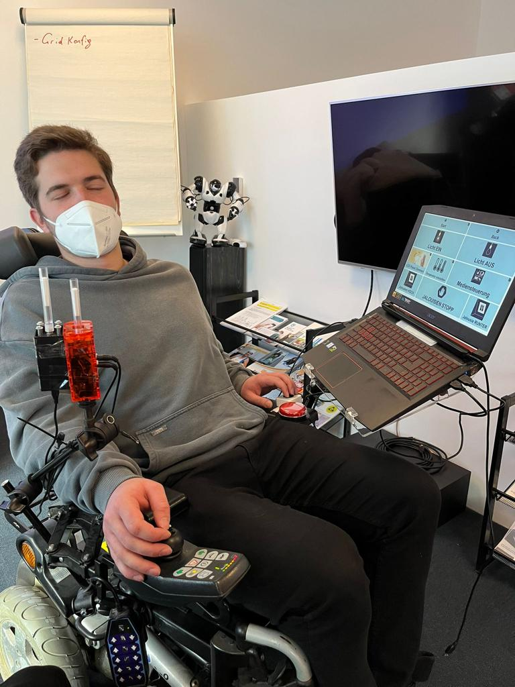

Es wurde derselbe Aufbau für alle 3 Gruppen verwendet. Für uns von Nutzen waren die beiden Buttons welche an der Linken Armlehne angebracht wurden sowie die schwarze Flipmaus. Die bereits montierte Flipmaus konnte leider nicht verwendet werden, wodurch eine zweite mit Klebeband angebracht wurde. Aufgrund von Sandras Beeinträchtigung wurden die beiden Buttons an der linken Seite des Elektrorollstuhles angebracht. Zur visuellen Darstellung des Grids wurde ein Laptop verwendet welche in angenehmer Position links vom Rollstuhl montiert wurde.
