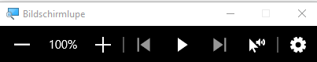

# ATGL - LABOR

## Use Case - Sandra
# 
#
### Aufgabenstellung
Aufgabe ist es, unter Berücksichtigung des gewählten Raumes technische Lösungen nach Sandras Wünschen zu entwickeln und anzuwenden. Der Raum für den diese Gruppe sich entschieden hat ist das Wohnzimmer.

### Kurzbeschreibung Klientin: Sandra
Die modernen Hilfsmittel, die wir zur Verfügung haben, sind ideal dafür der Klientin Sandra, ihren Wunsch nach einem selbstständigeren Leben zu erfüllen. Weil sie nicht nur körperlich beeinträchtigt ist, sondern auch eine starke Sehschwäche hat, müssen die Hilfsmittel klug gewählt werden.

Die Klientin verfügt bereits über einen Rollstuhl, einen Laptop und ein Smartphone. Die letzteren Zwei müssen aufgrund der Tatsache, dass sie Buchstaben nur in dreifacher Größe wahrnehmen kann (b21000) und über eine Rotschwäche (b21021) verfügt, dementsprechend angepasst werden. Außerdem ist die Einstellung eines höheren Kontrastes von Nöten (b21022). 

Dass sie dennoch über gewisse körperliche Funktionen verfügt, ermöglicht einen größeren Spielraum bei der Verwendung von Hilfsmittel. Abgesehen davon, dass sie ihren Kopf bewegen kann, sind auch Daumen und Zeigefinger am linken Arm vollkommen funktionstüchtig. Die Tatsache, dass sie ihren Mund bzw. ihre Lippen bewegen kann, ermöglicht die Verwendung einer FlipMouse. 

Die Tatsache, dass Zeigefinger und Daumen (am linken Arm) funktionstüchtig sind, lässt mehr Optionen offen. Da eine Kopf- und Mundbewegung möglich ist, tritt die Möglichkeit FlipMouse verwenden zu können in den Vorschein.

Die Klientin Sandra hofft, Licht, Temperatur, Jalousien und viele elektronische Geräte wie Fernseher, Musikanlagen und Spielzeug selbstständig steuern zu können. Außerdem möchte sie den Computer so steuern können, dass sie online gehen, E-Mails schreiben und beantworten kann. Außerdem möchte sie mit Hilfe von Phillips Hue Go oder Infrarotlicht Sounds kreieren, Computerspiele adaptieren und visuelle Effekte erzeugen. Ihr letzter Wunsch ist, dass sie ohne Hilfe ihr Smartphone zum SMS Versenden oder Anrufe tätigen verwenden kann.
#
## AsTeRICs Grid
Was ist das

# Beschreibung

# Beschreibung

# Beschreibung

# Beschreibung

# Beschreibung

# Beschreibung

# Beschreibung
#
## Eingabegeräte - FlipMouse & FABI
Was sind diese Geräte und wofür.
### FlipMouse Einstellungen
# Bild
Beschreibung
# Bild
Beschreibung
### FlipMouse Anwendung
### FABI Einstellungen
# Bild
Beschreibung
# Bild
Beschreibung
### FABI Anwendung
#
## Betriebssystem (Windows) - Accesibility
TEXT
### Bildschirmlupe

Die Bildschrimlupe ist eine Funktion von Windows die dabei helfen soll, den akutellen Bildschriminhalt zu vergrößern. Da Sandra nur Buchstaben in dreifacher Größe erkennen, löst diese Funktion ihre Probleme wenn sie mit dem Computer arbeitet.
#### Aktivierung + Einstellung - Bildschirmlupe
Um die Bildschirmlupe zu aktivieren kann die Windows-Logo-Taste + Plus-Taste (+) verwendet werden. Das Deaktivieren der Bildschirmlupe erfolgt über Windows-Logo-Taste + ESC.
Da es für Sandra leichter ist die Maus zu bedienen, kann einfach das Start-Symbol wählen -> Einstellungen -> Erleichterte Bedienung -> Bildschirmlupe -> Bildschirmlupe aktivieren.

In den Einstellungen kann der Zoomfaktor verändert werden, sowie die Zoomintervalle. Außerdem wird durch die Bedingung "Bildschirmlupe nach der Anmeldung starten" und "Bildschrimlupe vor der Anmeldung für alle Benutzer starten" die tägliche Anwendung der Bildschirmlupe erleichtert.
Bei der Bildschirlupenansicht können 3 Funktionen eingestellt werden.

  1. Vollbild - Der gesamte Bildschriminhalt wird vergrößert dargestellt. Auf dem Monitor sieht man immer einen Ausschnitt.
 
  
  
  2. Angedockt - Die Vergrößerung erscheint in einem gesonderten Fensterbereich, den Sie beliebig verschieben können.
  
 
 
  3. Lupe - Der bereich unter dem Mauszeiger erscheint vergrößert. Die Größe der Lupe kann ebenfalls eingestellt werden

 
 
Außerdem kann man einstellen, wem die Bildschirmlupe folgen soll.

#### Anwendung - Bilschirmlupe

Mit der Funktion "-" und "+" kann die Verkleinerung bzw. Vergrößerung der Bildschrimlupe gesteuert werden. Die Anzeige zwischen denen zeigt den aktuellen Zoom an. Wobei 100% das Minimum ist und 1600% das Maximum.

Um die Lesefunktion zu aktivieren, muss der Text den man vorgelesen haben möchte, markiert werden. Danach drückt man einfach auf "Play". Mit der Funktion "Ab hier lesen" (der Mauszeiger mit dem kleinen Lautsprecher) kann man eine Zeile auswählen, die schließlich vorgelesen wird.

Die Einstellungen der Bildschirmlupe ermöglichen es die Geschwindigkeit des Sprechers zu modifizieren, genau so wie die Sprache und die Stimme des Sprechers.

### Spracherkennung
Mit der Spracherkennung von Windows 11 kann man in innerhalb kürzester Zeit Texte diktieren. Die Funktion wird automatisch aktiviert und kann direkt benutzt werden.
#### Aktivierung - Spracherkennung
Um die Spracherkennung zu aktivieren geht man auf Start -> Einstellungen -> Erleichterte Bedienung -> Spracherkennung

#### Anwendung - Spracherkennung
Mithilfe eines Spracheingabegeräts können Befehle mit der Spracherkennung ausgeführt werden. Hierzu drückt man den Knopf mit dem Symbol eines Mikrofons und gibt einen Befehl per Headset oder Mikrofon ein.
Falls die Bedienung den Befehl verstanden hat führt sie ihn aus. Wenn sie den Befehl nicht verstanden hat, zeigt die Anzeige den Text "Wie bitte?". Danach bekommt man die Möglichkeit nochmal einen Befehl einzugeben.

